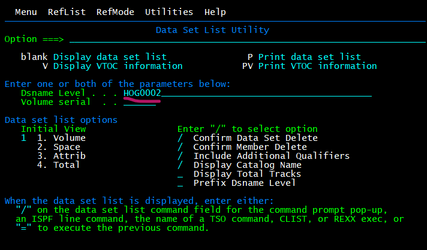
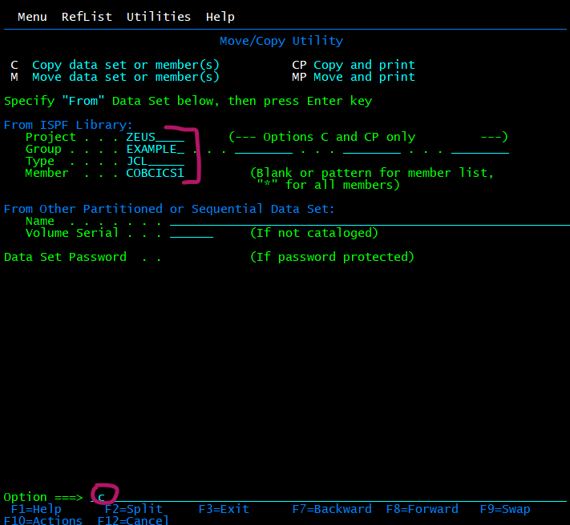
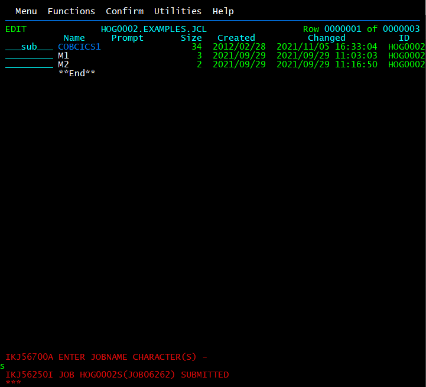

# write

Als eerst gaan we naar een PDS en voegen we een member toe om het programma te schrijven. Ga met **optie 3.4** (3 = Utilities en 4 = Dslist) naar eigen PDS door bij Dsname Level HOG0002 in te vullen. En ga naar de PDS voor het CICS programma.   

  

Of maak een nieuwe PDS.  
Maak een PDS zoals volgende afbeeldingen (optie a voor allocate).  
Maak met **optie 3.2** (3 = Utilities en 2 = Data set) een PDS aan.  

  
  

Maak met **optie 2** (2 = Edit) een member. De 02 aan het einde van de naam is de persoonlijke TSO-identifier.  

  

Nu opent de member, vul hier onderstaande code in voor een simpel programma dat “This is my first cics program” print.  

````
 CBL CICS,WORD(CICS),LIB,NODYNAM,RENT 

    IDENTIFICATION DIVISION.
    PROGRAM-ID. HLCICS40.
    DATA DIVISION.
    WORKING-STORAGE SECTION.
    01 OUTMSG PIC X(54) VALUE 'This is my first cics program'.
    PROCEDURE DIVISION.
    MAIN.

        EXEC CICS
            SEND FROM(OUTMSG) ERASE 
        END-EXEC.

        EXEC CICS
            RETURN 
        END-EXEC.
````  

# compile and link-edit

Nu moeten we een JCL maken en uitvoeren. Hiervoor kopiëren we een JCL uit ZEUS.EXAMPLE.JCL(COBCICS1) en passen we deze aan zodat hij met onze gegevens werkt. Dit doen we met **optie 3.3** (3 = Utilities en 3 = Move/Copy).  

  
  

Onderstaande code is de orginele code die nog moet aangepast worden.  

````
//CL EXEC PROC=IGYWCL,LNGPRFX=IGY 
//STEPLIB DD DISP=SHR,DSN=CICSTS53.CICS.SDFHLOAD 
// DD DISP=SHR,DSN=IGY.SIGYCOMP 
//SYSPRINT DD SYSOUT=* 
//COBOL.SYSIN DD DISP=SHR,DSN=ZEUS.EXAMPLE.IBMCOB(COBCICS1) 
//LKED.CICSLOAD DD DISP=SHR,DSN=CICSTS53.CICS.SDFHLOAD 
//LKED.SYSLMOD DD DISP=SHR,DSN=UNICICS.ZNNN.LOADLIB(COBCICS1) 
//LKED.SYSIN DD * 
 INCLUDE CICSLOAD(DFHELII) 
 NAME COBCICS1(R) 
/* 
````  
Hieronder staat de aangepaste code.  

  

Nu runnen we de JCL met optie sub (submit).  

  

Hieronder kan je zien dat return code 0 is wat er op wijst dat er geen problemen waren (code mag 0 of 4 zijn).  

  

Nu is er een load module gegenereerd in UNICICS.Z002.LOADLIB(COBCICS1).  

# define and install

Nu moeten we naar de VTAM omgeving gaan, hiervoor doen we f3 en typen we logoff. Hier gaan we in CICS met f5. Typ enter om het scherm te clearen. 
Als eerst gaan we het **program type definiëren** door onderstaan de code te typen.  
````
CEDA DEF PROGRAM(HLCICS02) GROUP(HG02) LANGUAGE(COBOL)
````   
Dit opent het CEDA scherm, dit sluit je door f3 te doen. En vervolgens **definieer** je de **trasactie** om het programma te starten door onderstaande code te typen.  
````
CEDA DEF TRANS(HL02) GROUP(HG02) PROGRAM(HLCICS02) 
````  

Nu gaan we het **programma** en de **transactie instaleren**. Hiervoor gaan we de onderstaande code invoegen. Dit moet ook elke keer opnieuw ingegeven worden als er iets is aangepast in het programma.  
````bash
CEDA INSTALL PROGRAM(HLCICS02) GROUP(HG02)
# en (elk apart ingeven)
CEDA INSTALL TRANS(HL02) GROUP(HG02)
````  

# run

Nu kan je het programma hier laten lopen door de transactie identidier te typen.  
````
HL02
````  
Je kan terug uit CICS gaan door onderstaande code te typen.  
````
CESF logoff
````