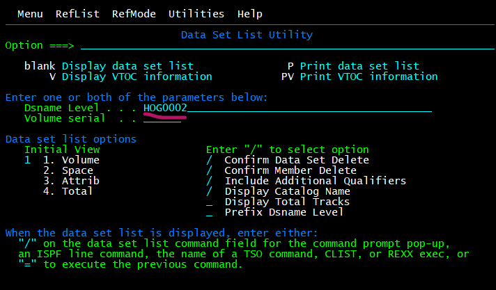

# ISPF

# 1. Logging on and off  

Om uit te loggen moet je x typen bij options in ISPF en nadien bij ready logoff typen. Nadien typ je nog één keer logoff en dan kan je het sluiten.  

# 2. Navigating through the ISPF menu options

Ga naar 3.4 (3 = Utilities, 4 = Dslist), hier kan je een Dsnaam ingeven om alle PDSen te tonnen.  
  

Scrollen: omhoog = f7, omlaag = f8, f10 = links en f11 = rechts.  

Dsorg column: Geeft weer oe de data georganiseerd is. PS = physical sequential, PO = physical partitioned en DA physical direct (Er staat een U achter als het unmovable is).  

Optie s = select voor view, v = view, e = edit.  

f1 = help.  

terug gaan met f30 of optie return.  

Option 0 (0 = settings) select iets met / en doe deselect iets met delte.  

pfshow off/pfshow on toont of verbergt de f toets commandos.  

actions in options menu verplaatst de cursor naar de bovenste optie balk, bij status kan je het rechter stuk aanpassen.  

# 3. Working with data sets

# 4. Working with the ISPF editor

# 5. Working with SDSF