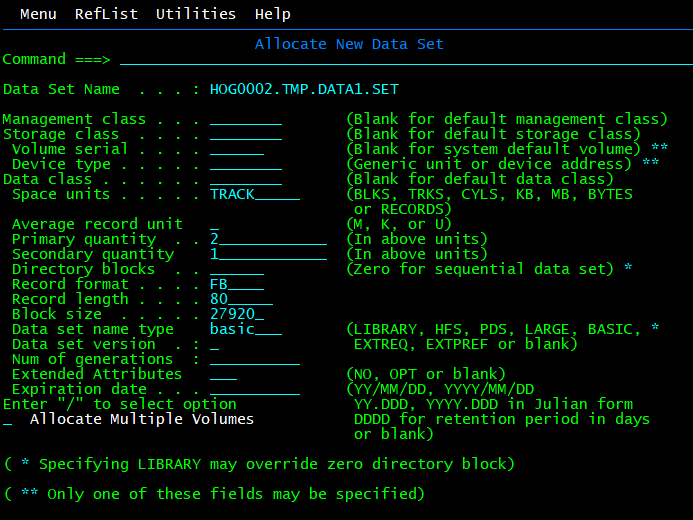
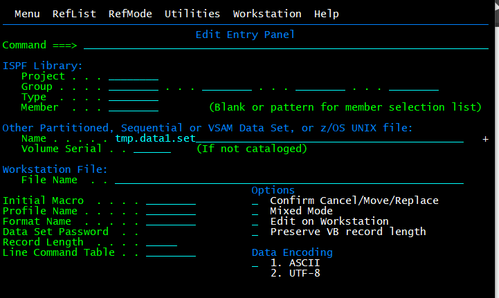
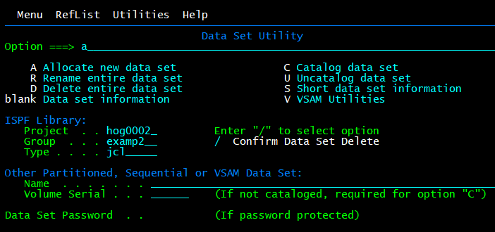
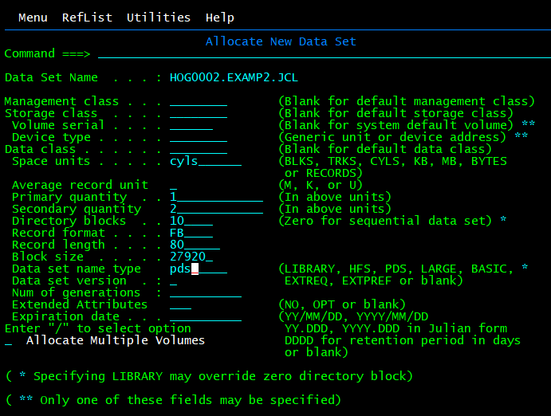

# ISPF

# 1. Logging on and off  

Om uit te loggen moet je x typen bij options in ISPF en nadien bij ready logoff typen. Nadien typ je nog één keer logoff en dan kan je het sluiten.  

# 2. Navigating through the ISPF menu options

Ga naar 3.4 (3 = Utilities, 4 = Dslist), hier kan je een Dsnaam ingeven om alle PDSen te tonnen.  
  

Scrollen: omhoog = f7, omlaag = f8, f10 = links en f11 = rechts.  

Dsorg column: Geeft weer oe de data georganiseerd is. PS = physical sequential, PO = physical partitioned en DA physical direct (Er staat een U achter als het unmovable is).  

Optie s = select voor view, v = view, e = edit.  

f1 = help.  

terug gaan met f30 of optie return.  

Option 0 (0 = settings) select iets met / en doe deselect iets met delte.  

pfshow off/pfshow on toont of verbergt de f toets commandos.  

**actions** in options menu verplaatst de cursor naar de bovenste optie balk, bij status kan je het rechter stuk aanpassen.  

# 3. Working with data sets
## Create sequential data set and catalog it

Ga naar 3.2 (3 = Utilities, 2 = Data Set) en vul in + option a voor alocate.  

  

  

## Rename data set

  

  

## Edit dataset

Ga met 3.4 naar de PDSen, en enter / er voor om optieste tonen (e = edit), enter om in memer te komen.  

## Edit dataset optie 2

Ga naar optie 2 en vul de naam in en enter.  

  

## Allocate PDS for JCL code

Optie 3.2.  

  

  

Optie 3.2.  

  

## Add member to pds

Optie 2.  

  

## Add member to pds optie 2

Optie 3.4, optie e voor pds.  

  

## Move/copy data set

Optie 3.3.  

  

  

(mod optie copïeert de data in de mem nog is)  
(old option vervangt de kopie door de nieuwe versie)  

## Copy member PDS to difrent PDS

Optie 3.3.  

  

  

  

Exit met f3 (je kan meerdere keren enteren).  

## Working with DsList Utility

Option 3.4.  

Command top gaat terug naar top lijst (bottom beneden).  

Find sys1.proclib vind opgegeven naam als hij verder in de lijst staat (f5 gaat terug naar de laatst gezocht member).  

# 4. Working with the ISPF editor

# 5. Working with SDSF